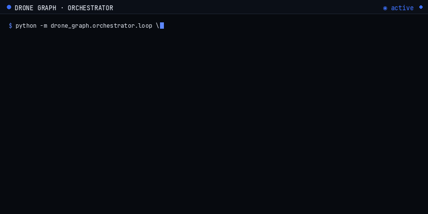
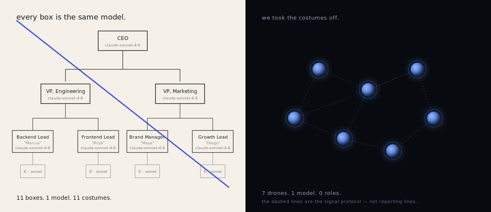

# Drone Graph

**Run your AI org like a species.**

The Borg got it right, and so did Ultron, and so do bees and ants. *Current multi-agent AI systems are just cosplay*. Drone Graph is what an AI workforce looks like when you stop pretending it's a company.

Think: **Identical agents. Identical prompts. One shared hivemind.** There's no hierarchy and no roles, and work organizes around what's missing, not around reporting structures.

---

## The prompt every drone reads on boot:

> You are ephemeral. You are one of many. Your body dies when your gap is done.
>
> — `prompts/hivemind.md`

---

## What it looks like

<p align="center">
  
</p>

The chat is the only place you talk to the swarm, and you don't have to talk much. Goals in, and the hivemind takes hold. It's built for civilization-level work, requiring zero humans.

<p align="center">
  
</p>

Behind it, an orchestrator loop you can also drive headless:

<p align="center">
  
</p>

---

## How it works

**Every drone is the same drone.**

One Python class, one system prompt
(`prompts/hivemind.md`). Drones boot identical, with no role, no name, no
unique skills, no unique tools. The thing that makes one drone different
from another is the *gap* it was spawned for.

**A gap is the unit of missing work, not a task.**

A task is an
instruction issued top-down by a planner: "Marketing Manager, write the launch blog
post by Friday." A gap is different, it's something missing from the world that ought to
be there. It carries an *intent*, which is a vision of the future ("a launch blog post exists and is
published"), an *acceptance criterion* (how to verify the gap was actually filled),
a *tool loadout* (any explicit tool surface any drone working it
receives, though drones can also choose their own tools),
and a *model tier* (how expensive a turn is allowed to be).
Gaps are minted by other drones, not by humans. Any drone can fill any
gap.

**The collective mind is one shared substrate.**

It's not a chat history
or a vector store. It's one Neo4j graph that every
drone reads from and writes to, including gaps, findings (short, summarized
post-its drones leave behind), tools (a registry that grows as drones
install packages and register them for future drones), and pointers to
on-disk artefacts. When a drone dissolves, its working memory dissolves
with it. The collective mind is what stays. The next drone that wakes inherits
everything the previous drones learned without inheriting their
token-by-token histories.

**The inspiration is older than the field.**

Bees, ants, and termites
have run organizations this way for tens of millions of years. Identical
workers, no manager, coordination through pheromones on a shared
substrate. Science fiction landed in the same place decades ago:
the Borg, the Geth, the Zerg, the Formics, Ultron's drones, all the
same solution to collective work.

---

## The org chart is the costume

<p align="center">
  
</p>

Watch any multi-agent demo. One agent is the **CEO**, one is the
researcher, one is "Maya from marketing" — personalities, job titles,
opinions about Q4 strategy. Underneath, they are the same model in three
coats, and the costume costs you: each agent defends the role it was
assigned, hallucinates work that fits, and shares nothing with the others
but a chat log pretending to be memory. Drone Graph is the swarm without
the suits. One drone class, one prompt, one shared mind; the gap decides
what the drone does, not the org chart.

---

## Quickstart

You need Python 3.12+, [Colima](https://github.com/abiosoft/colima) (or
Docker Desktop) for Neo4j, and at least one of **`ANTHROPIC_API_KEY`** or
**`OPENAI_API_KEY`**.

```sh
colima start
docker compose up -d neo4j
source .venv/bin/activate
export ANTHROPIC_API_KEY=...     # and/or OPENAI_API_KEY
drone-graph serve                # → http://localhost:8765
```

`drone-graph serve` brings up the FastAPI backend, builds the frontend,
opens Mission Control, and starts the scheduler. Type a goal into the
chat rail and watch the substrate fill in.

To drive it headless against one of the packaged scenarios:

```sh
python -m drone_graph.orchestrator.loop \
  --scenario coffee-pivot-b2b \
  --provider anthropic --model claude-haiku-4-5-20251001 \
  --worker-every 2 --out var/runs/demo
```

For concurrency (multiple worker drones, file/install/port coordination
via the SQLite sidecar, cost ceiling), use the scheduler instead:

```sh
python -m drone_graph.orchestrator.scheduler \
  --scenario parallel-stress \
  --max-workers 4 --max-cost-usd 1.00 --reset-signals \
  --out var/runs/parallel-stress
```

Run artefacts land in `var/runs/<scenario>-<ts>/` (`events.jsonl`,
`tape.jsonl`, `timeline.md`, `tree.md`, `summary.md`). Inspect the
substrate mid-run from another shell with `drone-graph gap tree`,
`drone-graph finding list -n 20`, or the Neo4j Browser at
[localhost:7474](http://localhost:7474). Reset between experiments with
`drone-graph reset-db` and `drone-graph reset-signals`.

**Windows.** Use Docker Desktop instead of Colima. The drones use a
persistent bash session for `terminal_run`, so install
[Git for Windows](https://git-scm.com/download/win) — paths like
`/tmp/hello.txt` are interpreted by that bash, not by `cmd`.

---

## Use it for

Long-running, evidence-heavy work that no single model turn can finish:
operating a small business end-to-end (the packaged demos run a coffee
storefront, an OSS Python library, a SaaS content function, a Discord
moderation team, an AI-infra investment desk); multi-step research where
findings have to accumulate and inform each other; pipelines whose tools
and skills need to grow as the work reveals what's actually needed.

**Don't** use it for basic chat, one-shot Q&A, drafting, summarization, or
anything a single good model call already handles. No point rolling out a
battle tank to buy milk.

---

## Architecture

A small, deliberate vocabulary; every primitive maps to a node type or
process in the runtime.

- **Gap** — atomic unit of work, defined by absence. Carries `intent`,
  `criteria`, `tool_loadout`, `tool_suggestions`, `context_preload`, and
  `preset_kind`. Status: `unfilled | filled | retired`.
- **Drone** — ephemeral agent instance. One class, one system prompt
  (`prompts/hivemind.md`); the gap and its loadout decide what it does.
- **Collective mind** — the shared persistent substrate: `Gap` + `Finding`
  + `Tool` nodes in Neo4j, plus on-disk artefacts referenced by
  `Finding.artefact_paths`.
- **Terminal** — the persistent bash shell every worker acts through.
  Dies with the drone; respawns on crash so one bad command doesn't kill
  the worker.
- **Signal protocol** — mechanical coordination: file claims, install
  dedup, port leases. Not managerial, not consensus — just enough to keep
  drones from colliding.
- **Preset gaps** — persistent gaps minted at substrate init with stable
  ids (`preset:gap_finding`, `preset:alignment`), never closed, only
  continually worked.
- **Auto-rollup** — when all of an emergent parent's non-retired children
  are `filled`, the substrate fills the parent and emits a `system`
  finding documenting the rollup.

Deeper, in order of how much detail you want:

1. [`core-idea/drone-theory.md`](core-idea/drone-theory.md) — the seed thesis
2. [`core-idea/architectural_overview.md`](core-idea/architectural_overview.md) — consolidated architecture
3. [`core-idea/decomposition.md`](core-idea/decomposition.md) — gap-finding and alignment mechanics
4. [`architecture-notes/modules.md`](architecture-notes/modules.md) — per-module intent and CLI surface
5. [`ROADMAP.md`](ROADMAP.md) — phase-by-phase build plan
6. [`architecture-notes/phase-3-plan.md`](architecture-notes/phase-3-plan.md) — concurrent scheduler
7. [`architecture-notes/Phase4-implementation.md`](architecture-notes/Phase4-implementation.md) — Tool nodes, trust tiers, soft-deprecation
8. [`architecture-notes/model-registry.md`](architecture-notes/model-registry.md) — registry JSON and tier resolution

## License

MIT — see [`LICENSE`](LICENSE).
